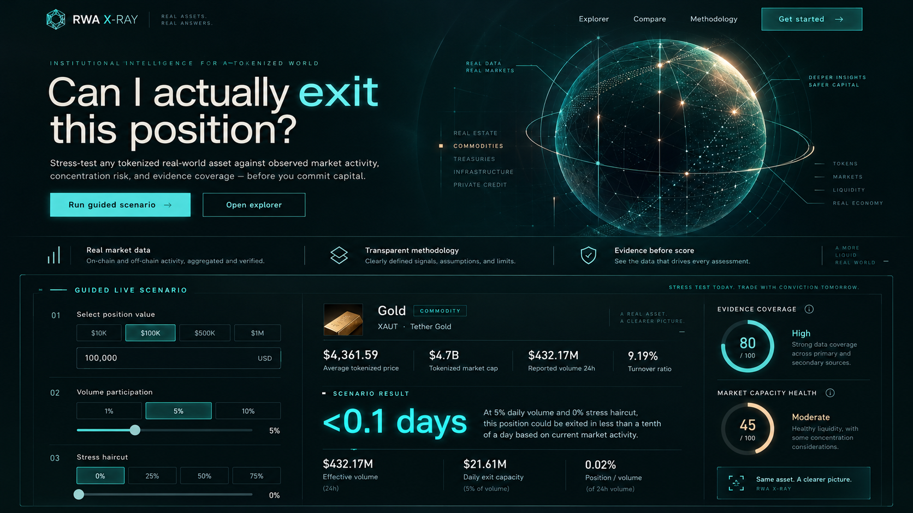
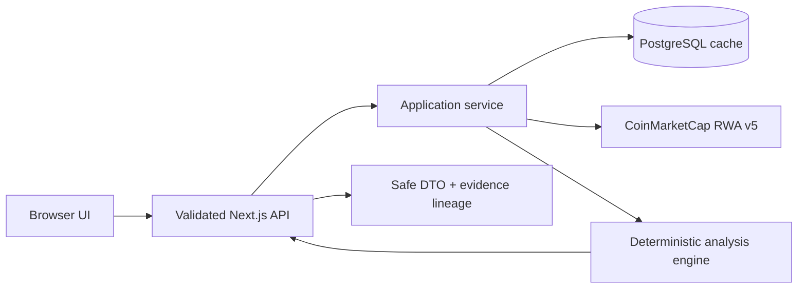

# RWA X-Ray

> **Can I actually exit?** — alat intelijen likuiditas untuk Real-World Assets (RWA) yang ditokenisasi.

RWA X-Ray membantu investor, analis, dan treasury manager memahami apakah sebuah aset RWA hanya terlihat besar berdasarkan market cap, atau benar-benar memiliki aktivitas pasar yang cukup untuk mendukung ukuran posisi mereka.

Proyek ini dirancang untuk **Build with CMC: API Hackathon 2026**, track **Real World Assets**.

**Live demo:** [rwa-xray.vercel.app](https://rwa-xray.vercel.app)

**Source:** [github.com/rfnasution01/rwa-xray](https://github.com/rfnasution01/rwa-xray)

## Masalah

Market cap tidak sama dengan likuiditas. Sebuah token dapat memiliki valuasi besar, tetapi:

- volume perdagangan rendah;
- aktivitas terkonsentrasi pada satu market atau issuer;
- harga berbeda antar-token atau market;
- data tidak cukup lengkap untuk membuat keputusan;
- posisi besar membutuhkan waktu lama untuk keluar jika hanya mengambil sebagian kecil volume harian.

Dashboard harga biasa tidak menjawab pertanyaan utama pengguna:

> “Jika saya memiliki posisi sebesar $100.000, seberapa besar kapasitas pasar yang tersedia dan apa risikonya?”

## Solusi

RWA X-Ray menyediakan:

1. **RWA Explorer** — pencarian dan penyaringan aset berdasarkan jenis, market cap, volume, dan turnover.
2. **Exit Capacity Simulator** — estimasi jumlah hari berdasarkan ukuran posisi dan batas partisipasi volume.
3. **Market Concentration** — distribusi volume antar-market, exchange, token, dan issuer.
4. **Market Capacity Health** — skor transparan dengan rincian formula, data, dan Evidence Coverage terpisah.
5. **Compare Mode** — perbandingan beberapa aset berdasarkan metrik yang relevan.
6. **Evidence Panel** — bukti panggilan API, waktu pembaruan, dan sumber setiap metrik.

## Baseline produk yang disetujui

- Primary persona: **Treasury/Risk Analyst**.
- Fokus awal: **tokenized government securities**.
- Guided demo: posisi **$100.000**, participation rate **5%**, USD.
- Metrik utama: Estimated Exit Days, Daily Exit Capacity, dan Position-to-Volume Ratio.
- Deferred roadmap: Historical Replay dan grounded AI Due-Diligence Memo; keduanya tidak aktif pada release hackathon.
- UI: English, dark-first Sleek and Futuristic design system dengan light-mode compatibility.
- Akses publik tanpa akun.

Keputusan lengkap tersedia di [docs/DECISIONS.md](docs/DECISIONS.md).

## Prinsip produk

- **Evidence before narrative** — angka dan sumber ditampilkan sebelum penjelasan AI.
- **No false precision** — simulasi adalah indikator kapasitas, bukan prediksi slippage.
- **Transparent scoring** — seluruh formula dapat diperiksa pengguna.
- **Missing data is information** — data yang hilang menurunkan confidence, bukan diam-diam dianggap nol.
- **API key stays server-side** — key tidak pernah dikirim ke browser atau repository.

## Sumber data CoinMarketCap

Integrasi utama menggunakan endpoint RWA v5:

- `GET /v5/real-world-assets/map`
- `GET /v5/real-world-assets/info`
- `GET /v5/real-world-assets/assets/list`
- `GET /v5/real-world-assets/market-pairs/list`
- `GET /v5/real-world-assets/quotes/latest`
- `GET /v5/real-world-assets/issuers/list`
- `GET /v5/real-world-assets/issuers`

Lihat [docs/API.md](docs/API.md) untuk kontrak integrasi dan strategi penggunaan credit.

## Product preview



Additional audited views: [Explorer](docs/design/assets-reference.png), [Asset X-Ray](docs/design/asset-detail-reference.png), and [Compare](docs/design/compare-reference.png).

## Architecture at a glance



The API key and database connection remain server-side. Full boundaries, cache policy, snapshot flow, and failure semantics are documented in [docs/ARCHITECTURE.md](docs/ARCHITECTURE.md).

## Dokumentasi

- [Product Requirements Document](docs/PRD.md)
- [Arsitektur Sistem](docs/ARCHITECTURE.md)
- [Metodologi dan Formula](docs/METHODOLOGY.md)
- [Integrasi CoinMarketCap API](docs/API.md)
- [Roadmap 21 Hari](docs/ROADMAP.md)
- [Checklist Submission](docs/SUBMISSION.md)
- [Approved Decisions](docs/DECISIONS.md)
- [Live Infrastructure Setup](docs/LIVE_SETUP.md)
- [Adaptive Snapshot Worker](docs/SNAPSHOTS.md)
- [Production Deployment](docs/DEPLOYMENT.md)
- [Final UX, Accessibility, and Release Audit](docs/AUDIT.md)

## Local development

```bash
cp .env.example .env.local
pnpm install
pnpm dev
```

Validasi repository:

```bash
pnpm lint
pnpm typecheck
pnpm test
pnpm build
```

Jangan memasukkan API key ke variable `NEXT_PUBLIC_*`.

Verifikasi CMC dan Supabase setelah `.env.local` dikonfigurasi:

```bash
pnpm verify:live
```

Lihat [docs/LIVE_SETUP.md](docs/LIVE_SETUP.md).

Menjalankan snapshot worker secara manual:

```bash
pnpm snapshot:broad
pnpm snapshot:priority
```

Scheduler dan persistence dijelaskan di [docs/SNAPSHOTS.md](docs/SNAPSHOTS.md).

Setelah deployment, jalankan smoke test tanpa memuat credential ke browser:

```bash
pnpm smoke:production -- https://your-production-domain.example
```

Vercel environment, migration, GitHub secrets, security headers, dan rollback dijelaskan di [docs/DEPLOYMENT.md](docs/DEPLOYMENT.md).

## Sasaran hackathon

| Kriteria           | Implementasi                                                  |
| ------------------ | ------------------------------------------------------------- |
| Does it work — 30% | Demo publik, caching, error state, dan alur end-to-end        |
| Usefulness — 25%   | Menjawab keputusan konkret tentang kapasitas keluar           |
| API use — 20%      | Menggabungkan assets, quotes, token, issuer, dan market pairs |
| Code quality — 15% | Type safety, test formula, dokumentasi, dan observability     |
| Presentation — 10% | Demo berbasis cerita dan bukti panggilan API                  |

## Status

Tahap saat ini: **production release dan feature freeze**.

Sudah tersedia:

- Next.js App Router + TypeScript strict + Tailwind;
- Vitest dan Playwright foundation;
- Drizzle/PostgreSQL foundation;
- environment validation;
- CI lint, typecheck, unit test, build, dan secret scan;
- formula awal Exit Capacity beserta unit test;
- typed server-side CMC client untuk tujuh endpoint RWA;
- validasi query/response, timeout, bounded retry, in-flight deduplication, dan redaction;
- sanitized CMC fixtures tanpa ketergantungan live API pada test;
- normalization layer untuk tujuh response RWA dengan stable domain models;
- evidence metadata, UTC timestamps, warning codes, dan preservasi `null` vs `0`;
- PostgreSQL persistent cache dengan runtime validation, TTL per endpoint, dan stale fallback maksimal 24 jam;
- cached RWA repository dengan canonical cache keys dan concurrent request deduplication;
- migration Drizzle untuk cache, canonical asset, dan quote foundation;
- Analysis Engine v1.1.0 untuk turnover, Exit Capacity dan planning horizon, freshness, four-dimensional concentration, normalized HHI, robust price dispersion, Evidence Coverage, dan Market Capacity Health;
- application service yang mengorkestrasi quotes, metadata, market pairs, benchmark, dan partial-data fallback;
- internal API `GET /api/assets` dan `GET /api/assets/:rwaId` dengan safe DTO, validation, standard envelope, dan rate limiting;
- guided live scenario dengan valid fallback, interactive Exit Capacity presets, evidence/data-gap states, dan contextual disclaimer;
- responsive RWA Explorer dengan filter, sort, current-page search, pagination, loading, empty, stale, rate-limit, serta error states;
- full Asset X-Ray page dengan simulator, four-dimensional concentration, price dispersion, token/market tables, Health/Evidence breakdown, sanitized lineage, warnings, dan partial-data states;
- Compare Mode 2–4 aset dengan shared scenario, neutral ordering, partial results, dan data-gap labels;
- `POST /api/compare` serta dedicated `GET /api/assets/:rwaId/evidence` dengan validated input dan safe response;
- production security headers, server/edge Sentry, redacted structured logs, configuration-aware readiness, manual GitHub release-verification workflow, serta secret-safe live/production smoke gate yang mewajibkan bukti Market Pairs;
- canonical metadata per route, Open Graph/Twitter share images, WebApplication JSON-LD, `robots.txt`, dan `sitemap.xml` untuk production discoverability.

Live verification telah mengonfirmasi migration dan persistent cache melalui Supabase Session Pooler serta seluruh tujuh endpoint CMC. Akses Startup plan untuk `market-pairs/list` aktif; Asset X-Ray dan Compare telah diverifikasi dengan market concentration serta price dispersion dari response live. Adaptive snapshot worker, GitHub Actions scheduler, security headers, production smoke harness, dan public Vercel deployment telah tersedia. Production CI, public smoke test, serta manual priority snapshot workflow telah terverifikasi. Minimal production monitoring aktif dengan server/edge Sentry dan redacted structured logs; DSN production telah dikonfigurasi dan SDK transport test berhasil di-flush.

Deferred P1 yang bukan release blocker: Historical Replay API/UI, hourly market-pair aggregation/retention, Grounded AI Due-Diligence Memo, shareable scenario URL, PostHog analytics, dan chart visualisasi. Jika chart ditambahkan kelak, fallback table/teks wajib tersedia pada perubahan yang sama.

## Disclaimer

RWA X-Ray adalah alat riset dan edukasi, bukan nasihat keuangan. Estimasi kapasitas tidak memperhitungkan seluruh order-book depth, slippage, biaya, pembatasan redemption, jam pasar, maupun perubahan volume setelah transaksi dilakukan.
