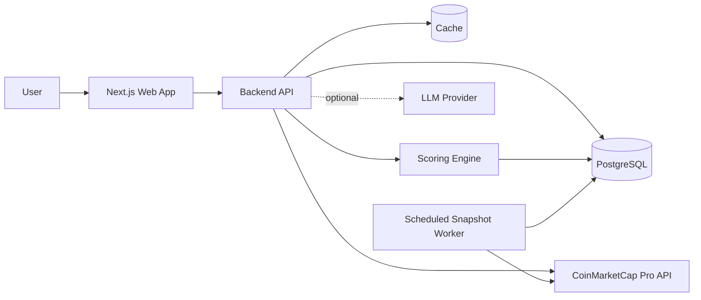
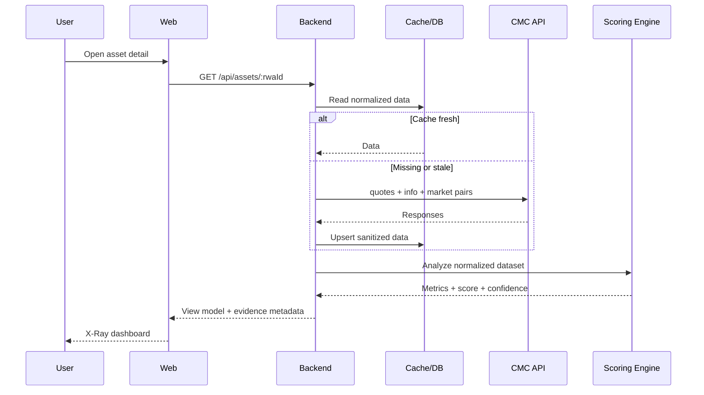

# Arsitektur Sistem

## 1. Tujuan

Arsitektur RWA X-Ray harus dapat didemokan dalam 21 hari, menjaga API key, menghemat call credit, dan tetap berfungsi jika komponen AI tidak tersedia.

Baseline deployment yang disetujui:

- Next.js App Router + TypeScript strict di Vercel;
- Supabase PostgreSQL + Drizzle ORM;
- TanStack Query untuk browser data fetching;
- tabel dan ringkasan teks untuk visualisasi release; Apache ECharts tetap opsi roadmap dan baru akan ditambahkan bersama fallback accessible;
- semantic React components + Tailwind CSS; Radix/shadcn tetap opsi hanya jika kebutuhan interaction primitive muncul;
- GitHub Actions menjalankan Node.js snapshot script secara langsung;
- Sentry + structured logs untuk observability;
- PostHog cookieless tanpa session recording tetap deferred dan belum aktif.

## 2. Diagram konteks



## 3. Komponen

### Web application

- Next.js + TypeScript.
- Server components untuk shell/static content; focused Client Components untuk polling, Explorer controls, dan simulator.
- TanStack Query memanggil internal API setiap 60 detik saat tab aktif.
- Guided demo meminta government securities terlebih dahulu lalu memakai RWA valid bervolume tertinggi dengan label fallback jika category live kosong.
- Explorer melakukan pagination/filter/sort melalui backend, menampilkan application observation time dalam UTC serta cache state (`fresh`, `refreshed`, atau `stale`); search saat ini hanya memfilter page yang sudah diterima dan diberi label demikian. Setiap page memperkaya maksimal 250 asset-list records melalui satu batch `/info` request yang cached untuk logo metadata; kegagalan metadata tidak menggagalkan Explorer dan simbol tetap menjadi fallback.
- `/assets/[rwaId]` menampilkan simulator client-side, concentration per dimensi, price dispersion, token/market tables, methodology warnings, dan sanitized source lineage dari satu detail response. Backend memuat seluruh page market-pair sebelum analisis; kegagalan atau pagination yang tidak lengkap membuat evidence tersebut unavailable. Detail juga memakai `/map` untuk historical-coverage metadata dengan symbol lookup yang diverifikasi kembali terhadap canonical `rwa_id`; timestamp tersebut tidak diklaim sebagai Historical Replay.
- `/compare` menerapkan satu scenario pada 2–4 canonical RWA IDs, mempertahankan partial results, dan memakai neutral ordering berdasarkan Estimated Exit Days. Initial selection hanya menerima 50 kandidat `assets/list` berdasarkan volume; suggested peers memprioritaskan kategori target lalu jarak log tokenized market cap dan volume 24 jam, dengan rank/name sebagai fallback deterministik. Search dua karakter atau lebih berjalan server-side secara debounced dan dibatasi 50 hasil: exact symbol melalui `/map`, exact normalized slug melalui `/assets/list`, serta name matching pada 250 aset bervolume tertinggi. Browser tidak memuat seluruh universe atau melakukan refetch semua page setiap 60 detik. Quotes dan metadata dimuat dalam batch multi-ID, benchmark list dibagikan, sedangkan market pairs tetap dimuat per canonical asset yang benar-benar dikembalikan quote batch.
- `/issuers` menampilkan issuer directory terpaginasikan; `/issuers/[issuerId]` menampilkan token yang dilaporkan terkait dan menautkannya kembali ke canonical asset bila `rwa_id` tersedia.
- Response internal divalidasi dengan Zod di browser sebelum dirender.
- SEO memakai canonical metadata per route, static social-card generation, WebApplication JSON-LD, `robots.txt`, dan sitemap untuk route publik stabil. Dynamic asset/issuer metadata memakai canonical ID tanpa menambah upstream request khusus crawler.
- Tidak pernah menerima `X-CMC_PRO_API_KEY`.

### Backend API

Tanggung jawab:

- validasi parameter;
- komunikasi dengan CMC;
- caching dan deduplication;
- normalisasi response;
- kalkulasi metrik;
- redaksi data Evidence Panel;
- rate limiting aplikasi.

Backend menggunakan Next.js route handlers agar deployment sederhana. Jangan menambah backend kedua tanpa kebutuhan yang terukur.

### Database

PostgreSQL menyimpan persistent cache tervalidasi, canonical asset dan issuer, snapshot quote, snapshot market pair, hasil metrik berversi, serta aktivitas aset anonim untuk menentukan prioritas worker. Release hackathon tidak menyimpan raw upstream response, secret, authorization header, atau shared report.

### Cache

MVP menggunakan PostgreSQL persistent cache melalui Drizzle. Cache menyimpan normalized dataset yang divalidasi ulang saat dibaca; raw API key dan request header tidak pernah disimpan.

| Resource      | Update upstream | TTL fresh aplikasi |
| ------------- | --------------: | -----------------: |
| RWA map       |        30 detik |           30 detik |
| Asset list    |        60 detik |           60 detik |
| Quotes latest |        60 detik |           60 detik |
| Market pairs  |        60 detik |           60 detik |
| Metadata      |        30 detik |             24 jam |
| Issuer data   |        30 detik |              1 jam |

Kolom update upstream mendeskripsikan frekuensi publik CMC, sedangkan TTL fresh adalah kebijakan cache aplikasi. Metadata dan issuer sengaja memakai TTL lebih panjang karena relatif statis dan digunakan untuk enrichment/discovery; trade-off-nya, perubahan upstream dapat baru terlihat setelah 24 jam atau 1 jam. Browser dapat meminta ulang setiap 60 detik, tetapi server tetap menyajikan cache fresh sampai TTL aplikasi berakhir. Cache real terakhir dapat digunakan maksimal 24 jam sejak observasi ketika refresh upstream gagal, dengan label stale yang jelas. Payload invalid dihapus dan dimuat ulang. Kegagalan cache read/write tidak boleh mencegah penggunaan live upstream data.

### Scoring engine

Pure functions yang menerima normalized dataset dan mengembalikan:

```ts
interface AnalysisResult {
  methodologyVersion: string;
  calculatedAt: string;
  metrics: Record<string, MetricResult>;
  score: number | null;
  confidence: number;
  warnings: string[];
}
```

Engine tidak melakukan network call agar mudah diuji. Implementasi pure functions tersedia di `src/domain/analysis/` dengan methodology version `1.1.0` dan configuration hash deterministik. Pair berumur 15–60 menit mendapat penalti evidence; pair di atas 60 menit dikeluarkan. Composite health tidak diterbitkan jika bobot komponen tersedia kurang dari 60%.

### Snapshot worker

Implementasi tersedia pada `src/server/snapshots/`, CLI `scripts/snapshot.ts`, dan `.github/workflows/snapshots.yml`.

- Berjalan sebagai Node.js script dari GitHub Actions, bukan endpoint cron publik.
- Mengambil asset list setiap 15 menit secara batch.
- Mengambil top 10 government securities dan aset yang aktif dibuka setiap 5 menit.
- Market pairs hanya untuk aset prioritas agar credit terkendali.
- Menyimpan `observed_at` dan upstream `last_updated` secara terpisah.
- Aggregate quote disimpan jangka panjang; target retention raw market-pair adalah 30 hari sebelum hourly aggregation, tetapi aggregation/retention belum aktif.
- Historical Replay UI belum aktif; visualisasi mendatang wajib diberi label “collected by RWA X-Ray”.
- `401/403/429` pada Market Pairs membuka circuit breaker per-run; quote dan analisis parsial tetap disimpan.
- Retry dengan source `observed_at` yang sama idempotent melalui unique indexes.

Raw-pair hourly aggregation dan retention belum diaktifkan; data belum dihapus agar histori tidak hilang sebelum agregasi tersedia.

### AI explanation layer — deferred target

Komponen ini belum aktif pada release hackathon. Desain P1 yang disetujui tetap berupa provider-agnostic, on-demand, dan menerima hanya `AnalysisResult` terstruktur serta glossary. Implementasi mendatang wajib memvalidasi output, menolak angka yang tidak ada dalam input, memasukkan asset/snapshot/scenario/prompt/methodology version ke cache key, dan tetap nonaktif untuk stale fallback data.

## 4. Aliran request detail aset



## 5. API internal yang disarankan

| Method | Path                          | Fungsi                                                  |
| ------ | ----------------------------- | ------------------------------------------------------- |
| GET    | `/api/assets`                 | Explorer dan filter — implemented                       |
| GET    | `/api/assets/:rwaId`          | Detail, scenario, dan analisis — implemented            |
| GET    | `/api/compare/universe`       | Initial candidates dan bounded server-side search       |
| POST   | `/api/compare`                | Analisis 2–4 aset — implemented                         |
| POST   | `/api/simulate`               | Opsional; kalkulasi juga dapat dilakukan di client      |
| GET    | `/api/assets/:rwaId/evidence` | Sanitized lineage dan normalized excerpt — implemented  |
| GET    | `/api/issuers`                | Issuer directory aktif dan terpaginasikan — implemented |
| GET    | `/api/issuers/:issuerId`      | Issuer metadata dan linked token page — implemented     |
| POST   | `/api/reports`                | Deferred; belum tersedia pada release hackathon         |
| GET    | `/api/reports/:id`            | Deferred; belum tersedia pada release hackathon         |
| GET    | `/api/health`                 | Readiness validasi environment tanpa secret             |

Route handlers memakai application service/DAL dan tidak meneruskan response CMC atau record database mentah. Seluruh query divalidasi dengan Zod, response memakai envelope konsisten, cache key disembunyikan, dan optional source failure dikembalikan sebagai `dataGaps`. Basic per-instance rate limiting adalah defense tambahan; rate limiting Vercel tetap harus diaktifkan untuk enforcement lintas-instance. Security headers diterapkan global melalui `next.config.ts`; production smoke harness memverifikasi halaman, API, readiness, sensitive field names, dan header tersebut.

## 6. Model data minimum

```text
cmc_cache_entries
- cache_key PK (endpoint + canonical non-secret query)
- endpoint
- payload JSONB (normalized dataset)
- observed_at, expires_at, stale_until, updated_at

rwa_assets
- rwa_id PK
- name, symbol, slug, asset_type, rwa_rank
- first_historical_data, last_historical_data
- metadata_json
- source_updated_at, synced_at

rwa_quotes
- id PK
- rwa_id FK
- currency
- average_tokenized_price
- tokenized_market_cap
- tokenized_volume_24h
- source_updated_at, observed_at

rwa_tokens
- id PK
- rwa_id FK
- crypto_id
- issuer_id
- name, symbol
- price, market_cap, volume_24h
- observed_at

rwa_market_pairs
- id PK
- rwa_id FK
- market_id
- exchange_id, exchange_name
- market_pair, category
- price, volume_24h
- source_updated_at, observed_at

issuers
- issuer_id PK
- name
- payload_json
- synced_at

analysis_snapshots
- id PK
- rwa_id FK
- methodology_version
- metrics_json, score, confidence
- calculated_at
```

## 7. Normalisasi

- Gunakan `rwa_id` sebagai identifier utama, bukan simbol.
- Simpan uang sebagai decimal/numeric, bukan float database.
- Ubah waktu ke UTC ISO-8601.
- Bedakan `null`, `0`, dan field yang tidak tersedia.
- Simpan currency pada setiap monetary value.
- Hindari menjumlahkan volume tanpa memeriksa apakah agregat dan pair data akan menyebabkan double counting.

Implementation tersedia di `src/server/cmc/normalize.ts` dan menghasilkan model pada `src/domain/assets/models.ts`. Hanya field allowlisted yang keluar dari adapter; field passthrough upstream tidak diteruskan. Token row tanpa identitas minimum (`name` atau `symbol`) dikeluarkan dengan typed warning tanpa membuang parent RWA, sehingga satu row malformed tidak menggagalkan multi-asset quote batch. Setiap dataset membawa endpoint, response timestamp, observation timestamp, credit count, notice, serta typed normalization warnings.

## 8. Error handling

| Kondisi      | Respons produk                                      |
| ------------ | --------------------------------------------------- |
| 400          | Tampilkan input invalid; jangan retry               |
| 401/403      | Catat configuration error tanpa membuka key         |
| 429          | Gunakan cache stale, tampilkan warning, backoff     |
| 5xx upstream | Retry terbatas lalu fallback ke stale cache         |
| Partial data | Kalkulasi metrik yang valid dan turunkan confidence |
| No pair data | Concentration = unavailable, bukan 0                |

## 9. Security checklist

- `.env*` masuk `.gitignore`, kecuali `.env.example`.
- Gunakan `CMC_API_KEY` hanya di server runtime.
- Redact header dan query sensitif dari log.
- Dependency dan secret scan di CI.
- Batasi endpoint proxy; browser tidak boleh menentukan URL upstream bebas.
- Rate limit berdasarkan IP/session secara proporsional.
- Validasi `rwa_id`, limit, sort, dan currency melalui allowlist.

## 10. Observability

Sentry server/edge aktif di production ketika `SENTRY_DSN` tersedia. `instrumentation.ts` menangkap unhandled request errors, dan mapped API 5xx dilaporkan secara eksplisit. Sebelum transport, request headers, cookies, body, query string, serta configured secret values dihapus. Structured JSON logs memakai event name stabil dan safe context untuk API failures, cache failures/stale fallback, serta rate limiting; raw error message dan cache key tidak dicatat. Integrasi ini tidak memerlukan perubahan CSP karena tidak ada Sentry browser transport.

Pantau melalui Sentry dan structured logs:

- upstream latency dan status code;
- credit count dari status response;
- cache hit ratio;
- stale response count;
- kalkulasi gagal;
- data freshness;
- AI validation failure jika fitur AI aktif.

PostHog hanya menerima cookieless anonymous product events. Jangan aktifkan session recording atau mengirim nominal posisi, report URL, response API, API key, atau payload pengguna yang tidak diperlukan.

## 11. Keputusan MVP

1. Monolith Next.js lebih disarankan untuk kecepatan delivery.
2. Formula adalah pure functions terpisah dari UI.
3. PostgreSQL digunakan untuk snapshot dan cache persisten.
4. AI tidak berada di critical path.
5. Historical data hanya mengklaim periode yang benar-benar dikumpulkan aplikasi.
